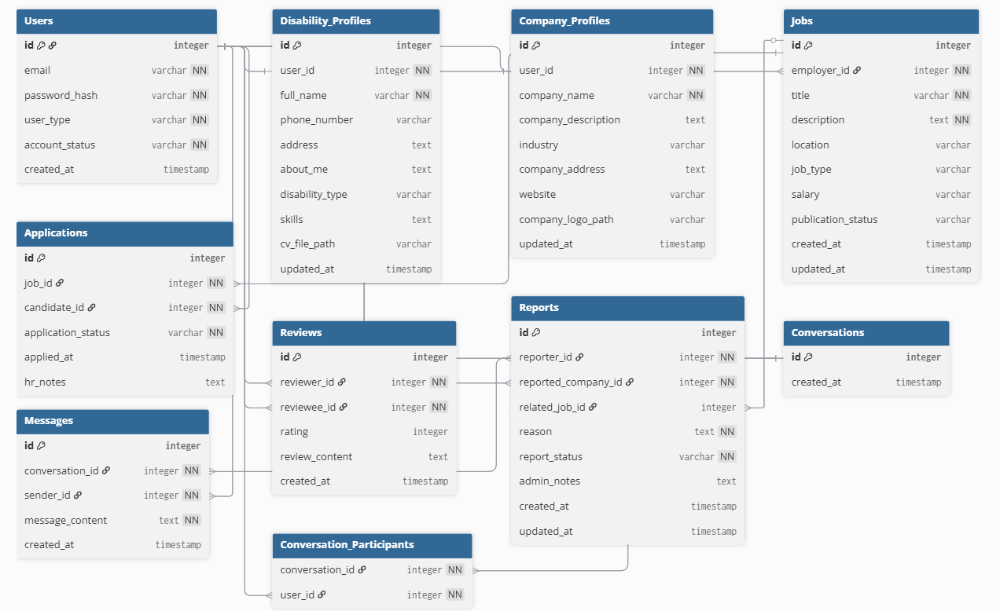

# 📘 Tugas 5 IMPAL
  
**Mata Kuliah:** Implementasi dan Pemeliharaan Perangkat Lunak (IMPAL)  

---

### 👥 Anggota Kelompok
| No | Nama Lengkap | NIM |
|----|---------------------------|----------------|
| 1 | Dinar Muhammad Akbar | 103012300333 |
| 2 | Jason Emmanuel | 103012300115 |
| 3 | Muhammad Furqan Maulidi | 103012330213 |
| 4 | Arief Bagas Nugraha | 103012300114 |

---

### 🗂️ Diagram Tabel Sistem
Berikut diagram tabel yang digunakan dalam sistem ini:

